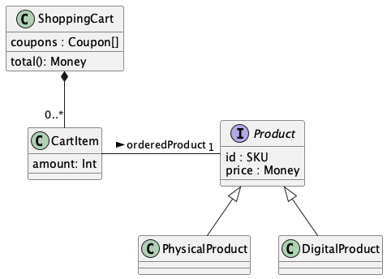
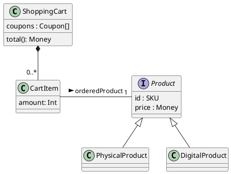

# Diagrams in 01-first-example
## example.puml
[Source](example.puml)

```plantuml
@startuml
class ShoppingCart {
    coupons : Coupon[]
    total(): Money
}
class CartItem {
    amount: Int
}
interface Product {
    id : SKU
    price : Money
}
class PhysicalProduct {}
class DigitalProduct {}
ShoppingCart *-- "0..*" CartItem
CartItem - "1" Product : > orderedProduct
Product <|-- PhysicalProduct
Product <|-- DigitalProduct
@enduml
```

