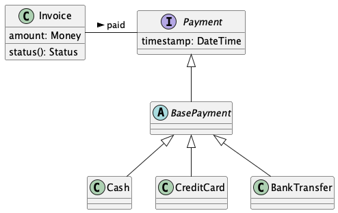
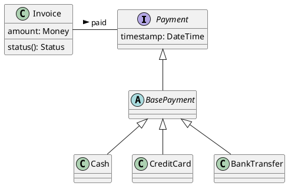
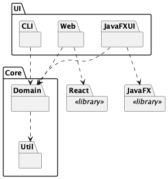
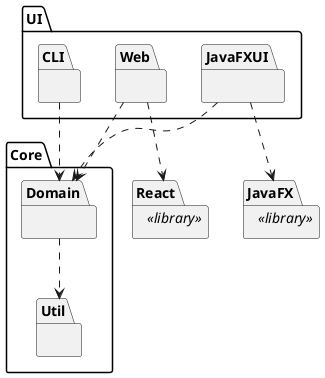
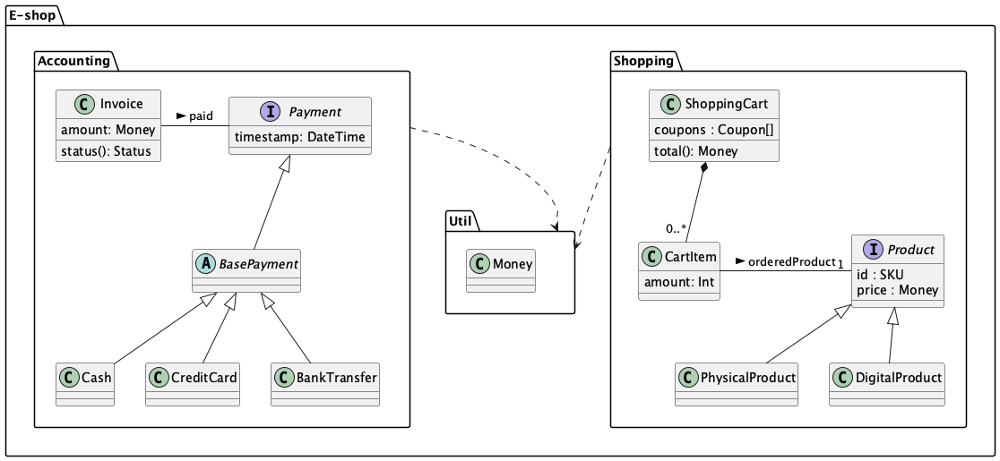
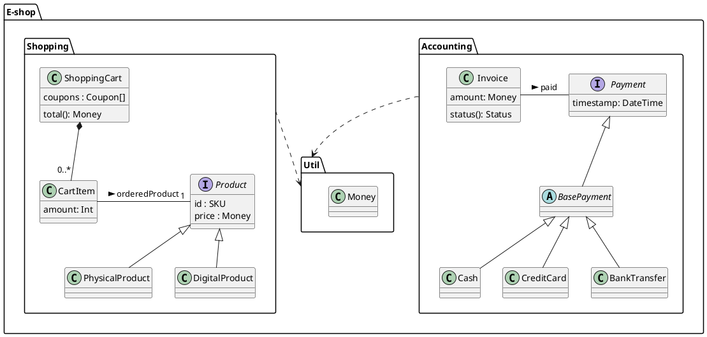
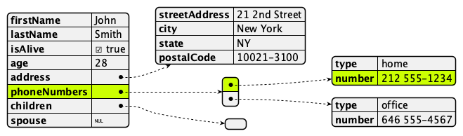
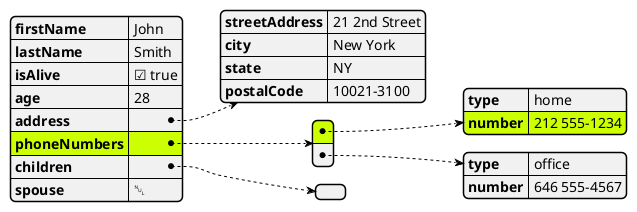

# Diagrams in 02-module-view
## 01-class-diagram.puml
[Source](01-class-diagram.puml)

## 02-package-diagram.puml
[Source](02-package-diagram.puml)

## 03-class-and-package.puml
[Source](03-class-and-package.puml)

## 04-data-types-json.puml
[Source](04-data-types-json.puml)

