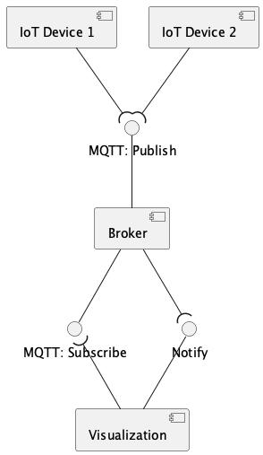
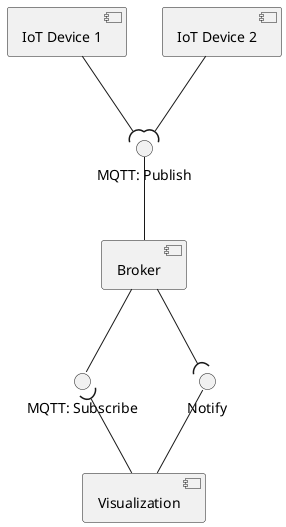
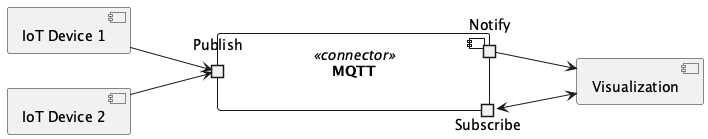
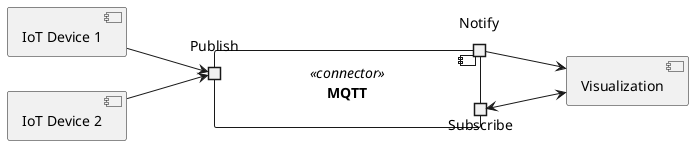

# Diagrams in 03-CC-view
## 01-component-diagram.puml
[Source](01-component-diagram.puml)

```plantuml
@startuml
component "IoT Device 1" as iot
[IoT Device 2] as iot2
() "MQTT: Publish" as MQTT
() "MQTT: Subscribe" as MQTTSub
() Notify

iot --( MQTT
iot2 --( MQTT

component Broker
component Visualization

MQTT -- Broker
Broker -- MQTTSub
Broker --( Notify
MQTTSub )-- Visualization
Notify -- Visualization
@enduml

```

## 02-component-diagram-ports.puml
[Source](02-component-diagram-ports.puml)

```plantuml
@startuml
left to right direction
component "IoT Device 1" as iot
[IoT Device 2] as iot2
component "MQTT" <<connector>> as MQTT {
    portin Publish
    portout Subscribe
    portout Notify
}
component Visualization
iot --> Publish
iot2 --> Publish

Subscribe <--> Visualization
Notify --> Visualization
@enduml
```

