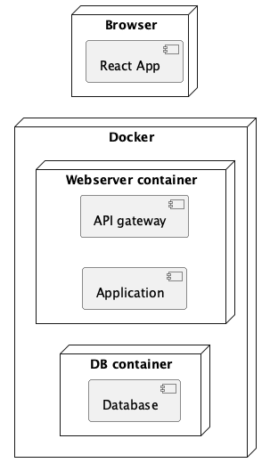
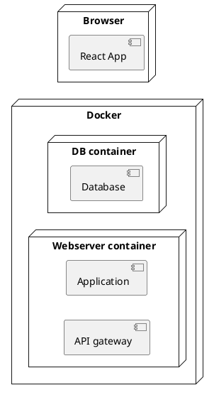
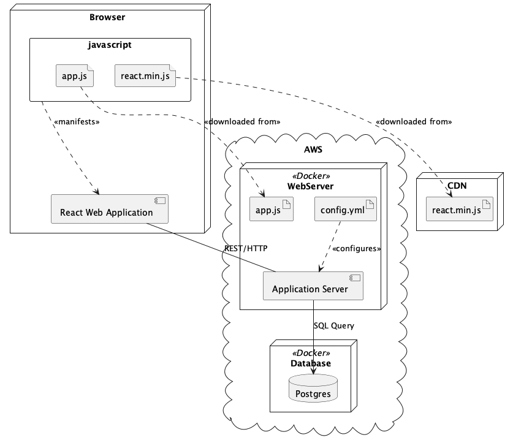
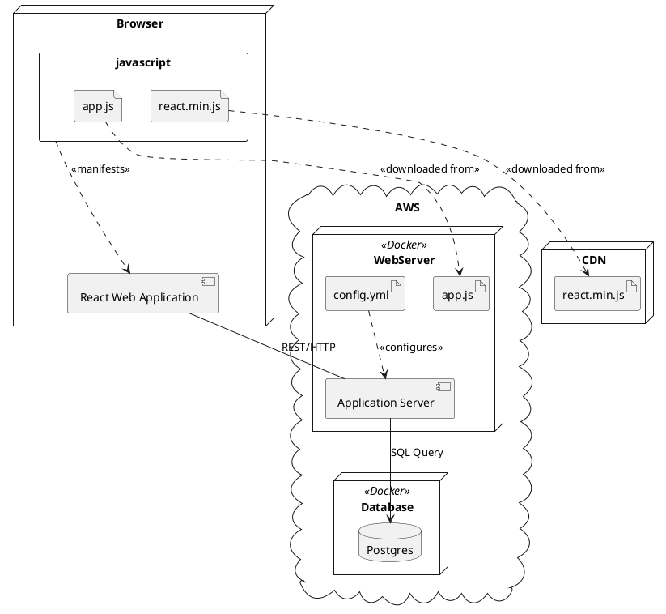

# Diagrams in 04-allocation-view
## 01-simple-deployment.puml
[Source](01-simple-deployment.puml)

```plantuml
@startuml
left to right direction
node Docker {
    node "DB container" {
        component Database
    }
    node "Webserver container" {
        component "Application" as app
        component "API gateway" as rest
    }
}
node Browser {
    component "React App" as react
}
@enduml

```

## 02-complex-deployment.puml
[Source](02-complex-deployment.puml)

```plantuml
@startuml
node "Browser" {
    component "React Web Application" as reactApp
    rectangle "javascript" as js {
        file "react.min.js" as reactjs
        file "app.js" as appjs
    }
}
node "CDN" {
    artifact "react.min.js" as reactjs_cdn
}
cloud "AWS" {
    node "WebServer" <<Docker>> {
        artifact "app.js" as appjs_server
        component "Application Server" as appServer
        artifact "config.yml" as configFile
    }
    node "Database" <<Docker>> {
        database "Postgres" as database
    }
}
reactApp -- appServer : "REST/HTTP"
appServer --> database : "SQL Query"
reactjs ..> reactjs_cdn : <<downloaded from>>
appjs .> appjs_server : <<downloaded from>>
configFile ..> appServer : <<configures>>
js ..> reactApp : <<manifests>>
@enduml

```

