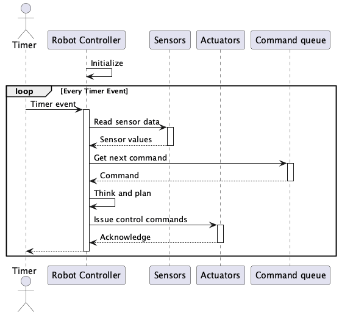
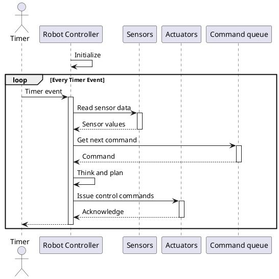
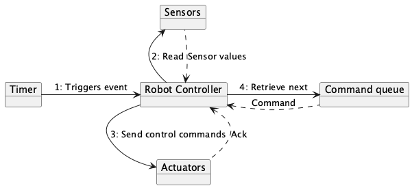
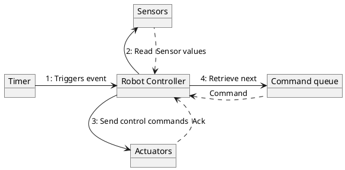
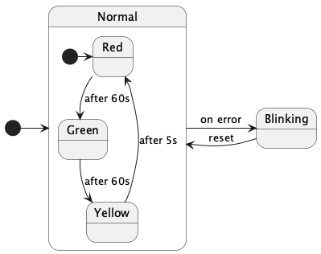
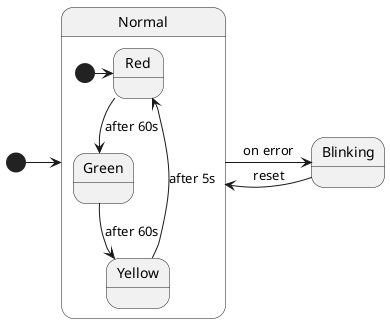
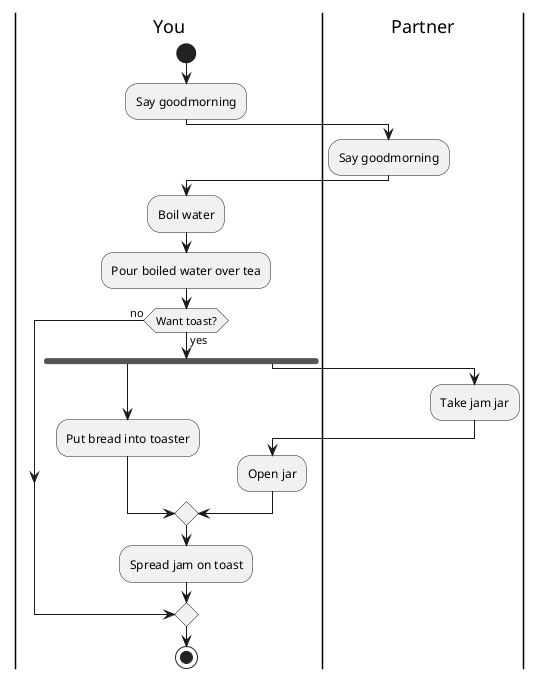
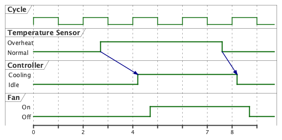
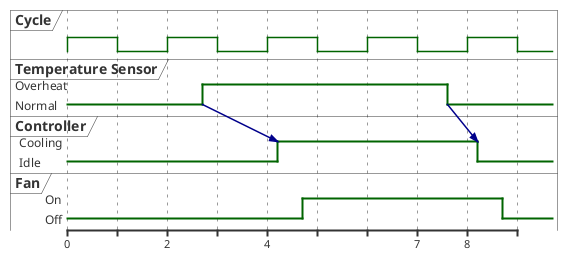

# Diagrams in 05-behavior
## 01-sequence.puml
[Source](01-sequence.puml)

## 02-collaboration.puml
[Source](02-collaboration.puml)

## 03-state.puml
[Source](03-state.puml)

## 04-activity.puml
[Source](04-activity.puml)

## 05-timing.puml
[Source](05-timing.puml)

