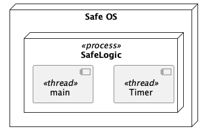
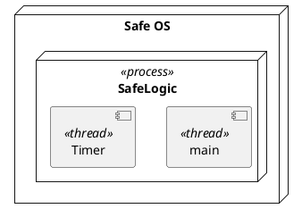
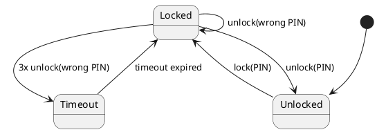
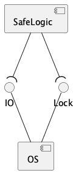
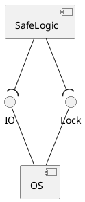
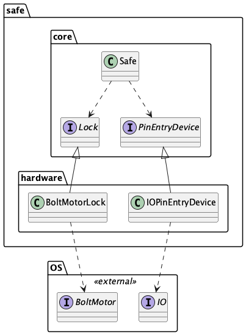
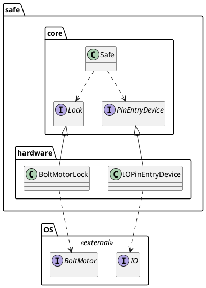

# Diagrams in safe-example
## allocation.puml
[Source](allocation.puml)

```plantuml
@startuml
node "Safe OS" {
    node SafeLogic <<process>> {
        component main <<thread>>
        component Timer <<thread>>
    }
}
@enduml
```

## behavior.puml
[Source](behavior.puml)

```plantuml
@startuml
state Locked
state Unlocked
state Timeout

[*] --> Unlocked
Unlocked --> Locked : lock(PIN)
Locked --> Unlocked : unlock(PIN)
Locked --> Locked : unlock(wrong PIN)
Locked --> Timeout : 3x unlock(wrong PIN)
Timeout --> Locked : timeout expired
@enduml
```

## cc.puml
[Source](cc.puml)

```plantuml
@startuml
component SafeLogic
component OS
() IO
() Lock

SafeLogic --( IO
SafeLogic --( Lock

IO -- OS
Lock -- OS
@enduml
```

## module.puml
[Source](module.puml)

```plantuml
@startuml
package OS <<external>> {
    interface IO {}
    interface BoltMotor {}
}
package safe {
    package core {
        class Safe {}
        interface Lock {}
        interface PinEntryDevice {}
        Safe ..> Lock
        Safe ..> PinEntryDevice
    }
    package hardware {
        class BoltMotorLock extends safe.core.Lock {}
        class IOPinEntryDevice extends safe.core.PinEntryDevice {}
    }

    BoltMotorLock ..> BoltMotor
    IOPinEntryDevice ..> IO

    ' package tests <<tests>> {
    '     package util {
    '         class DummyLock extends safe.core.Lock {}
    '         class DummyPINEntry extends safe.core.PinEntryDevice {}
    '     }
    ' }
}


@enduml
```

